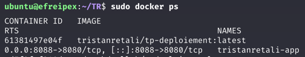
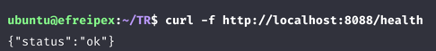

# TP Déploiement

API Flask dockerisée avec une pipeline CI/CD qui teste, build et déploie automatiquement sur une VM Azure.

## Le pipeline

4 jobs qui s'exécutent dans [deploy.yml] :

1. **unit-tests** : `pytest test_app.py`
2. **e2e-tests** : `pytest test_e2e.py`, qui démarre le vrai serveur et tape dessus en HTTP
3. **build-and-push** : build l'image Docker et la push sur Docker Hub
4. **deploy** : se connecte en SSH à la VM, `docker pull` la nouvelle image, redémarre le conteneur, puis vérifie que l'API répond

Chaque job dépend du précédent, donc si les tests cassent, rien n'est buildé ni déployé.

## Déclenchement

Tout part d'un `git push` sur `main`. Pas d'étape manuelle.

## Choix techniques

- **Conteneur toujours nommé `myapp`** : à chaque déploiement on fait `stop`/`rm`/`run` sur ce même nom. Du coup relancer le workflow ne duplique jamais de conteneur et ne casse rien
- **Rien en clair dans le repo** : les identifiants Docker Hub et l'accès SSH passent par des GitHub Secrets.
- **Image simple** : `python:3.12-slim` + `gunicorn` (pas le serveur de dev Flask), port 8080 dans le conteneur mappé sur le port 80 de la VM.

## Preuve de bon fonctionnement

